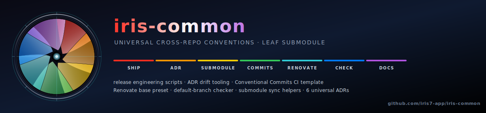

[](LICENSE)


Universal **cross-repo conventions** for the [iris7](https://gitlab.com/iris7)
project family — release engineering scripts, ADR tooling, Conventional
Commits CI template, Renovate base preset.

Part of **Iris**, an observability-first showcase across 7 facets.
See [iris-service-java](https://gitlab.com/iris7/iris-service-java)
for the master narrative + visual.

## Why this repo

Some scripts and configs are **truly universal** : they don't care whether
the consuming project is Java + Spring Boot, Python + FastAPI, or
Angular zoneless. Examples : a `git reset --hard` safety check
(`bin/ship/pre-sync.sh`), an ADR-index regenerator
(`bin/dev/regen-adr-index.sh`), a Conventional-Commits CI template,
the Renovate base config.

Putting these in `iris-service-shared` (the backend infra repo)
forces UI to pull in 90% irrelevant content (terraform, K8s, OTel
collector, postgres) just to use 2 small scripts. Putting them in
each consumer repo creates 3-4 copies that drift.

**Solution** : a leaf submodule consumed by every repo (java, python,
ui, AND shared-service itself).

## What lives here

| Path | Purpose | Used by |
|---|---|---|
| `bin/ship/pre-sync.sh` | Git-safety pre-flight before `git reset --hard` | every repo |
| `bin/ship/changelog.sh` | Generate CHANGELOG entry from Conventional Commits (`--tag-prefix` flag for per-repo tag namespaces) | every repo |
| `bin/ship/gitlab-release.sh` | Create GitLab Release object from a tag | every repo |
| `bin/ship/renovate-sync.sh` | Sync `renovate.json` across consumers from `renovate-base.json` | maintainer (run from any repo) |
| `bin/ship/check-default-branch.sh` | Verify all 4 iris-7 projects have `default_branch=main` | maintainer / pre-tag |
| `bin/ship/bump-common-everywhere.sh` | Bump `infra/common` SHA across all 4 consumers in one pass (commit + push + MR + auto-merge) | maintainer (run from `iris-common`) |
| `bin/dev/regen-adr-index.sh` | Regenerate `docs/adr/README.md` flat-index table from ADR files (`--check` for CI drift) | every repo (per-repo ADRs) |
| `ci-templates/conventional-commits.yml` | GitLab CI template enforcing Conventional Commits on every MR | every repo (`include:` from `.gitlab-ci.yml`) |
| `ci-templates/shellcheck.yml` | GitLab CI template running `koalaman/shellcheck-alpine` on `bin/**/*.sh` ; gates on `error` by default (override with `SHELLCHECK_SEVERITY=warning` once a repo's warning backlog is clean) | every repo with shell scripts |
| `ci-templates/adr-drift.yml` | GitLab CI template invoking `infra/common/bin/dev/regen-adr-index.sh --check` to fail when `docs/adr/` has new ADRs the index hasn't been re-regenerated against | every repo with `docs/adr/` |
| `renovate-base.json` | Common Renovate config, synced into each repo's `renovate.json` via `bin/ship/renovate-sync.sh` | every repo |
| `docs/adr/0001-shared-repo-via-submodule.md` | ADR explaining the submodule pattern (this repo is a concrete instance) | reference |
| `docs/adr/0055-shell-based-release-automation.md` | ADR justifying hand-rolled bash over `release-please` | reference |
| `docs/adr/0057-polyrepo-vs-monorepo.md` | ADR : kept polyrepo, no monorepo migration | reference |
| `docs/adr/0059-renovate-base-preset.md` | ADR : Renovate base preset + sync script (option B) | reference |

## What does NOT live here

Backend-specific infrastructure (clusters, terraform, K8s manifests,
OTel collector, postgres+kafka+redis compose stack, observability
dashboards) lives in **`iris-service-shared`**. It is consumed
by the backend repos (java + python) but NOT by ui — UI doesn't run
backends, doesn't deploy K8s clusters, doesn't manage cloud cost.

The split (this repo = universal ; iris-service-shared = backend)
formalises the boundary so each consumer pulls only what it needs.

## How consumers use this

```bash
# In iris-service-java, iris-service-python, iris-ui, iris-service-shared :
git submodule add https://gitlab.com/iris-7/iris-common.git infra/common
git commit -m "chore(submodule): add iris-common"

# Then call scripts via :
infra/common/bin/ship/pre-sync.sh
infra/common/bin/ship/changelog.sh --tag-prefix stable-v   # Java/UI default
infra/common/bin/ship/changelog.sh --tag-prefix stable-py-v # Python
infra/common/bin/dev/regen-adr-index.sh --check
```

## How to update

```bash
# In iris-common :
$ cd ~/dev/iris/iris-common
$ git switch main
# … edit, commit, push …
$ git push origin main

# In any consumer repo (manual single-bump) :
$ cd <consumer>/infra/common
$ git pull origin main
$ cd ../..
$ git add infra/common
$ git commit -m "chore(common): bump SHA — <reason>"
$ git push
```

**Bulk bump across all 4 consumers in one command** (faster, safer —
runs pre-flight checks first, then commits + pushes + creates MR with
auto-merge per consumer) :

```bash
$ cd ~/dev/iris/iris-common
$ bin/ship/bump-common-everywhere.sh           # creates MRs + auto-merge
$ bin/ship/bump-common-everywhere.sh --dry-run # preview without changes
```

The consumer repo's CI re-runs against the new common SHA. Tag the
consumer's own `stable-<prefix>-vX.Y.Z` when a milestone lands.

## Adding to a new consumer repo

```bash
git submodule add https://gitlab.com/iris-7/iris-common.git infra/common
git submodule update --init infra/common
```

Then add to `.gitlab-ci.yml` :

```yaml
include:
  - project: 'iris-7/iris-common'
    ref: main
    file: '/ci-templates/conventional-commits.yml'
```

(Or vendor the `infra/common/ci-templates/conventional-commits.yml`
content directly if you prefer pin-by-SHA over `ref: main`.)

## See also

- [CHANGELOG](CHANGELOG.md) — release notes
- [ADR-0001 — Shared repo via submodule](docs/adr/0001-shared-repo-via-submodule.md)
- [`iris-service-shared`](https://gitlab.com/iris-7/iris-service-shared) — backend infra (clusters, terraform, K8s, observability)
- Sibling repos : [java](https://gitlab.com/iris-7/iris-service-java) · [python](https://gitlab.com/iris-7/iris-service-python) · [ui](https://gitlab.com/iris-7/iris-ui)

## License

[BSD-3-Clause](LICENSE)
